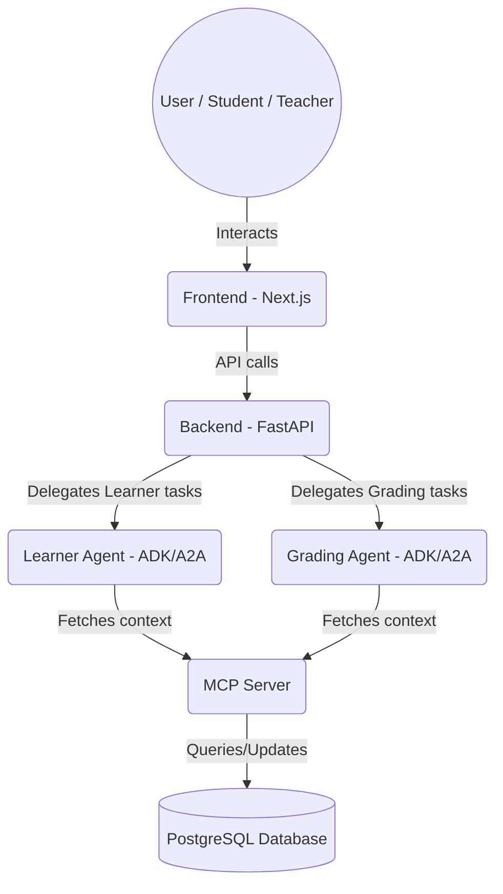

# Agentic Learning Management System (LMS)

## Problem
**Improving a legacy workflow:**
* Current LMS systems just use AI to generate performance stats (grades) only.
* There is no connection between the LLM and the course material.
* Course strategy is the instructors' sole headache.
* Most of grading is a manual process.

## Solution
* Use AI's reasoning (data) capabilities to assist in strategizing study plans.
* Automate manual tasks by having AI make preliminary grading and analysis decisions.

## Impact
* **Serving more people**
  * Automated grading saves time: ~10 mins per student.
  * Saves time of analysis: ~2 Hours per week / review.
* **Making higher quality decisions using a human-in-the-loop approach**
  * Students can focus on their weaknesses with better clarity of their mastery of the material, leading to better utilization of time.
  * Teachers can refine course material in real-time rather than waiting until the end of the year. Enables more experimentation and provides more robust data.

## Application Questions

**Q1: What the human can now do that they couldn't before?**
* Save time and make far more quality, data-driven decisions regarding student focus and curriculum adjustments.

**Q2: What AI is responsible for; where AI must stop;**
* AI is responsible for breaking down course materials and automating preliminary grading. The AI can't make final definitive evaluations on these subjective matters; the teacher remains in the loop to review AI suggestions, and adjust AI's decisions based on human reasoning.

**Q3: What would break first at scale?**
* The retrieval layer will become a bottleneck and needs to be upgraded to a robust Retrieval-Augmented Generation (RAG) architecture. Currently, the server can efficiently fetch relevant topics from the database to evaluate quiz responses. However, as the volume of topics and key concepts scales beyond ~100,000, the system will face significant performance degradation when querying and comparing responses against this large knowledge base.

---

## Architecture Design

Below is a simple architectural representation of how the components in this system interact.




---

## Setup and Run Instructions

### Prerequisites
* Python 3.10+
* Node.js 20+ (via NVM or directly)
* Docker (for the PostgreSQL database)
* `uv` package manager (for Python dependencies)

### Configuration
Create a `.env` file at the root of the project to set up your Gemini API access or Vertex AI credentials.

```sh
# Example for Gemini API direct usage
GOOGLE_API_KEY=<your_api_key_here>
GOOGLE_GENAI_USE_VERTEXAI=FALSE
```

### Running the Project Automatically
The easiest way to start the entire environment is by using the provided startup script:

```bash
chmod +x run_all.sh
./run_all.sh
```

### Running the Project Manually

If you prefer to run the components individually to see distinct logs, you can do so in separate terminals:

1. **Start Database**
   ```bash
   docker-compose up -d
   ```

2. **Start Backend**
   ```bash
   cd backend
   source venv/bin/activate
   uvicorn app.main:app --port 8000 --reload
   ```

3. **Start MCP Server**
   ```bash
   cd mcp-server
   source .venv/bin/activate
   PORT=8080 python server.py
   ```

4. **Start Learner Agent**
   ```bash
   uv run uvicorn learner_agent.agent:a2a_app --port 10000 --reload
   ```

5. **Start Grading Agent**
   ```bash
   uv run uvicorn grading_agent.agent:a2a_app --port 10001 --reload
   ```

6. **Start Frontend**
   ```bash
   cd frontend
   nvm use 20  # Make sure Node v20 is used
   npm run dev
   ```

### Accessing the Application
- **Frontend Dashboard:** http://localhost:3000
- **Backend API Docs:** http://localhost:8000/docs
- **MCP Server SSE:** http://localhost:8080/sse
